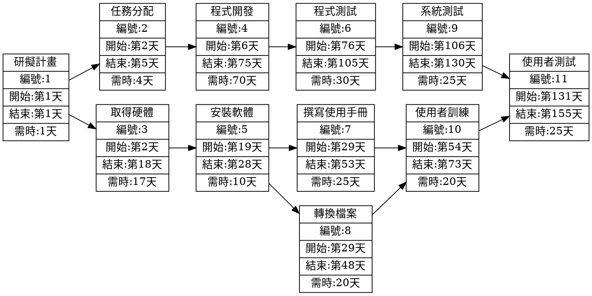
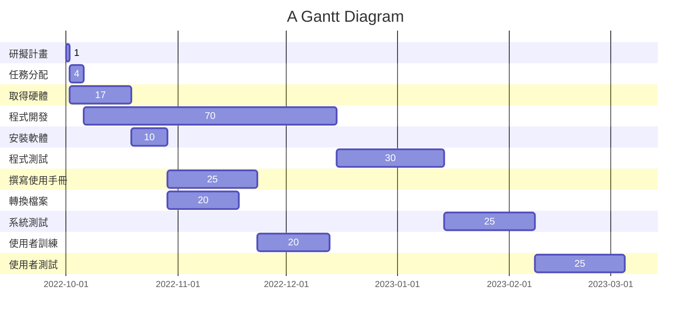

# 2022-3B C109118238 周瑪麗 hw2.md

## **PERT/CPM 圖**

```graphviz
digraph {
	node[shape=record];
	rankdir="LR";
    no1 [label = "研擬計畫 | 編號:1 | 開始:第1天 | 結束:第1天 | 需時:1天"]
    no2 [label = "任務分配 | 編號:2 | 開始:第2天 | 結束:第5天 | 需時:4天"]
    no3 [label = "取得硬體 | 編號:3 | 開始:第2天 | 結束:第18天 | 需時:17天"]
      no1->no2
      no1->no3
      {rank=same;no2 no3}
    no4 [label = "程式開發 | 編號:4 | 開始:第6天 | 結束:第75天 | 需時:70天"]
      no2->no4
    no5 [label = "安裝軟體 | 編號:5 | 開始:第19天 | 結束:第28天 | 需時:10天"]
      no3->no5
    no6 [label = "程式測試 | 編號:6 | 開始:第76天 | 結束:第105天 | 需時:30天"]
      no4->no6
    no7 [label = "撰寫使用手冊 | 編號:7 | 開始:第29天 | 結束:第53天 | 需時:25天"]
    no8 [label = "轉換檔案 | 編號:8 | 開始:第29天 | 結束:第48天 | 需時:20天"]
      no5->no7
      no5->no8
      {rank=same;no7 no8}
    no9 [label = "系統測試 | 編號:9 | 開始:第106天 | 結束:第130天 | 需時:25天"]
      no6->no9
    no10 [label = "使用者訓練 | 編號:10 | 開始:第54天 | 結束:第73天 | 需時:20天"]
      no7->no10
      no8->no10 
    no11 [label = "使用者測試 | 編號:11 | 開始:第131天 | 結束:第155天 | 需時:25天"]
      no9->no11
      no10->no11
}
```

---

## **甘特圖**

```mermaid
gantt
    title A Gantt Diagram
    section 研擬計畫
    1:a1, 2022-10-01, 1d
    section 任務分配
    4:a2,after a1  , 4d
    section 取得硬體
    17:a3,after a1  , 17d
    section 程式開發
    70:a4,after a2  , 70d 
    section 安裝軟體
    10:a5,after a3  , 10d
    section 程式測試
    30:a6,after a4  , 30d
    section 撰寫使用手冊
    25:a7,after a5  , 25d
    section 轉換檔案
    20:a8,after a5  , 20d
    section 系統測試
    25:a9,after a6  , 25d
    section 使用者訓練
    20:a10,after a7, 20d
    section 使用者測試
    25:a11,after a9, 25d
```
---

## **關鍵路徑**

